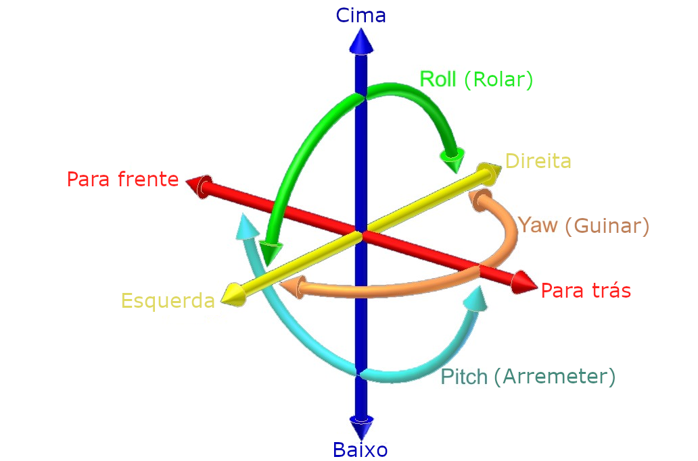
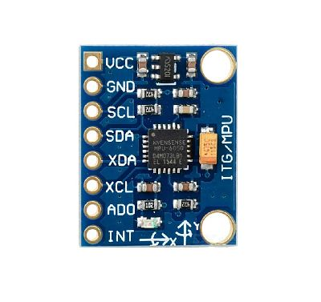

# Códigos fonte ESP8266 - Arduino IDE

Calibração de Acelerômetro MPU6050 utizando ESP8266
------

* **Pitch, yaw e roll** são as três dimensões do movimento quando um objeto se move no espaço tridimensional. 

  

* Assim como o movimento ao longo de cada um dos três eixos é independente, também a rotação sobre qualquer um desses eixos, o movimento tem seis graus de liberdade. 
  * Arremeter o **nariz (aeronave)** para cima ou para para baixo **PITCH**. 
  * Realizar uma guinada  do **corpo (aeronave)** da esquerda para a direita **movimento circular (no sentido horário ou anti-horário) YAW**.
  * Finalmente rolar para o lado esquerdo ou direito **ROLL**. 

Procedimentos de Calibração do Acelerômetro MPU6050
------
* O **MPU6050** deve ser colocado na posição horizontal, com as escritas da placa de circuito impresso orientadas para cima.
* Não toque no dispositivo até que seja mostrada a mensagem final.

  

* O sistema [**Acelerometro-Angulo**](../Acelerometro-Angulo "Teste de Calibração e utilização **MPU6050** Arduino IDE") deve ser utilizado para testas a calibração.

