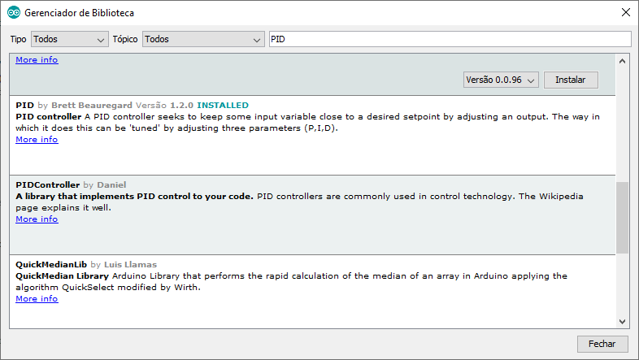

# Códigos fonte ESP8266 - Arduino IDE

Aplicação com Acelerômetro MPU6050 e PID (Controlador proporcional integral derivativo) utizando ESP8266
------
* **PID** é um modo de controle de processos que utiliza ações derivativa, integral e proporcional, criando um sinal mais constante considerando que sinal de erro tende minimizado pela ação proporcional, zerado pela ação integral e antecipado pela ação derivativa.

* Os controladores contínuos podem controlar os processos de quatro formas distintas:

  * Controle Proporcional (P);
  * Controle Integral (PI);
  * Controle Derivativo (PD);
  * Controle Proporcional Integral Derivativo (PID).

* **Ação proporcional (P)**
  * Produz um sinal de saída que é proporcional à amplitude do erro e(t), sendo **Kp** a constante de proporcionalidade.
  * Um ganho proporcional **muito alto** gera um sinal alto de saída, o que pode desestabilizar o sistema.
  * Um ganho proporcional **muito baixo** induz o sistema a falha, pois tem dificuldade em aplicar a ação necessária para corrigir as oscilações.

* **Ação Integral (I)**
  * Produz um sinal de saída que é proporcional à magnitude e à duração do erro, ou seja, ao erro acumulado, sendo **Ki** a constante de Integral.
  * Um ganho integral **muito alto** pode tornar o sistema instável.
  * Um ganho integral **muito baixo** atraza o sistema o qual pode levar muito tempo para atingir o valor de referência **(SetPoint)**.

* **Ação Derivativa (D)**
  * Produz um sinal de saída que é proporcional à velocidade de variação do erro, sendo **Kd** a constante de derivação.
  * Não deve ser utilizada em processos nos quais o sistema deve responder rapidamente a uma mudança de estado, e também deve ser evitado em processos que apresentem muito ruído no sinal de medido. Este fatores levam o processo à instabilidade.

* **Ajuste dos Parâmetros Kp, Ki e Kd**

  * O ajuste de parâmetros do controlador PID pode ser feito manualmente ou através de métodos de optimização como o método de Ziegler-Nichols. Nesse método, os ganhos **Ki** e **Kd** são ajustados para zero. Em seguida, aumenta-se o ganho proporcional **Kp** até que o sinal de saída começe a oscilar. Este valor é considerado o ganho crítico **Ku** e este perído de tempo é considedo o período crítico **Tu**.
  * Os ganhos dos controladores P, PI, PID são então ajustados conforme a tabela abaixo **(Método de Ziegler-Nichols)**:

<center>

Controle do Processo | Kp | Ki | Kd
| :-: | :-: | :-: | :-: |
P | 0,5 * Ku  |  |  |
PI | 0,45 * Ku  | 1,2 * Kp / Tu |  |
PI | 0,65 * Ku  | 2 * Kp / Tu | Kp * Tu / 8 |

</center>



* Detalhes e particularidades do código usando a IDE Arduino e ESP8266

```c++
/********************************************************
 * PID Exemplo Básico
 * Lê entrada analógica e controla uma saída PWM
 ********************************************************/

#include <PID_v1.h>

#define PIN_ENTRADA 0
#define PIN_SAIDA 3

//VAriáveis de configuração do PID
double setPoint, entrada, saida;

//Valores para os ganhos das constante do PID
double Kp=2, Ki=5, Kd=1;
PID controlePID(&entrada, &saida, &setPoint, Kp, Ki, Kd, DIRECT);

void setup() {
  entrada = analogRead(PIN_ENTRADA);
  setPoint = 100;
  controlePID.SetMode(AUTOMATIC);
}

void loop() {
  entrada = analogRead(PIN_ENTRADA);
  controlePID.Compute();
  analogWrite(PIN_SAIDA, saida);
}

```
