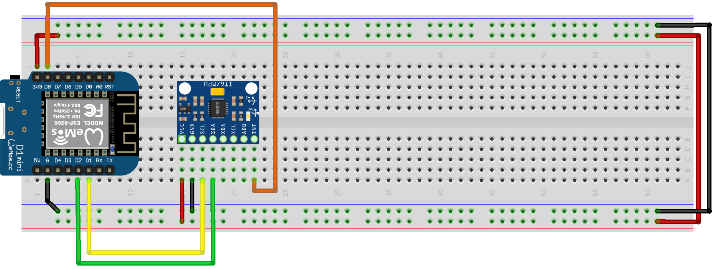

# Códigos fonte ESP8266 - Arduino IDE

Acelerômetro utizando ESP8266
------

* Na utilização do DMP (Digital motion Processor)  com a IDE arduino e ESP8266 será necessário a importação da biblioteca **MPU6050**.
* Instalação da biblioteca **MPU6050**


* Detalhes e particularidades do código usando a IDE Arduino e ESP8266

```c++

#include "I2Cdev.h"
#include "MPU6050_6Axis_MotionApps20.h"
#include "Wire.h"

#define INTERRUPT_PIN 15 //D8

MPU6050 mpu;
```
* Na utilização do DMP (Digital motion Processor) devera ser seguido o esquema de ligação apresentado.
* Detalhes do sensor **MPU6050** e Esquema de ligação do sensor **MPU6050**
<p align="center">
  
  
</p>

* Para verificar o desempenho e funcionamento do sensor **MPU6050** sera necessário a utilização do **Processing software**, no site https://processing.org/download/


