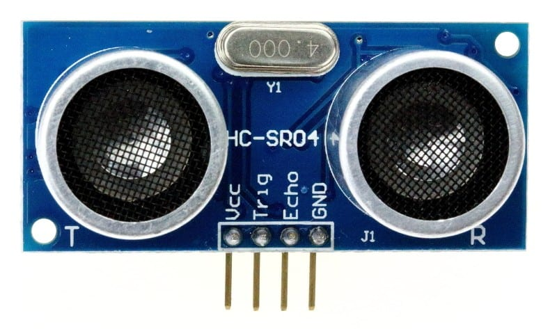
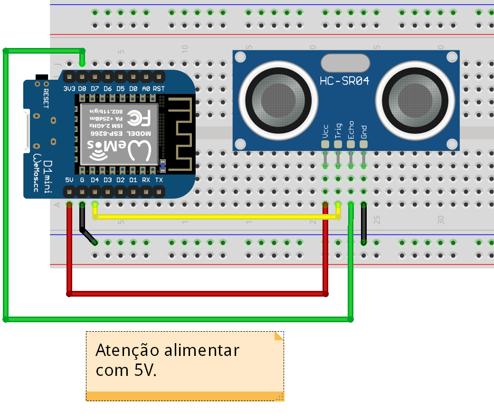

# Códigos fonte ESP8266 - Arduino IDE

Sensor ultrassônico (HC-SR04) utizando ESP8266
------

* Sensor ultrassônico (HC-SR04)  com a IDE arduino e ESP8266 será necessário a importação da biblioteca **Ultrasonic**.
* Instalação da biblioteca [**Ultrasonic**](../../Bibliotecas/Ultrasonic "Instalação Biblioteca Ultrasonic - Arduino IDE").

* Detalhes e particularidades do código usando a IDE Arduino e ESP8266

```c++
#include <Ultrasonic.h>

#define TRIGGER_PIN  0    //D4
#define ECHO_PIN     15   //D8

Ultrasonic ultrasonic(TRIGGER_PIN, ECHO_PIN);

void setup() {
  Serial.begin(115200);
}

void loop() {
  float cmMsec;
  long microsec = ultrasonic.timing();

  cmMsec = ultrasonic.convert(microsec, Ultrasonic::CM);
  Serial.print("Distância = ");
  Serial.print(cmMsec);
  Serial.println("cm");
  delay(1000);
}
```
* Na utilização do Sensor ultrassônico (HC-SR04) devera ser seguido o esquema de ligação apresentado.
* Detalhes do sensor **HC-SR04** e Esquema de ligação do sensor **HC-SR04**
<p align="center">
  
  
</p>
